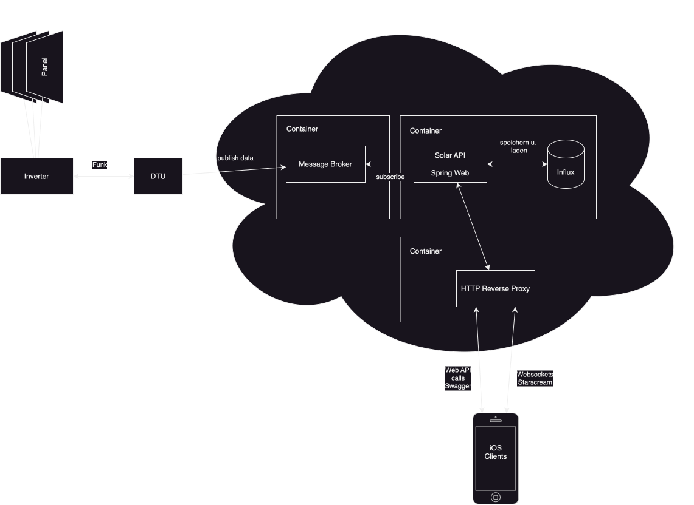

A spring boot web application to save values from the solar system.

- Ahoy DTU publish data to an mqtt broker, the java application is listening for incoming messages and stores the data in a mongodb (only logs) and influxdb
- An iOS app connects to the api and gets data such as logs or energy data

